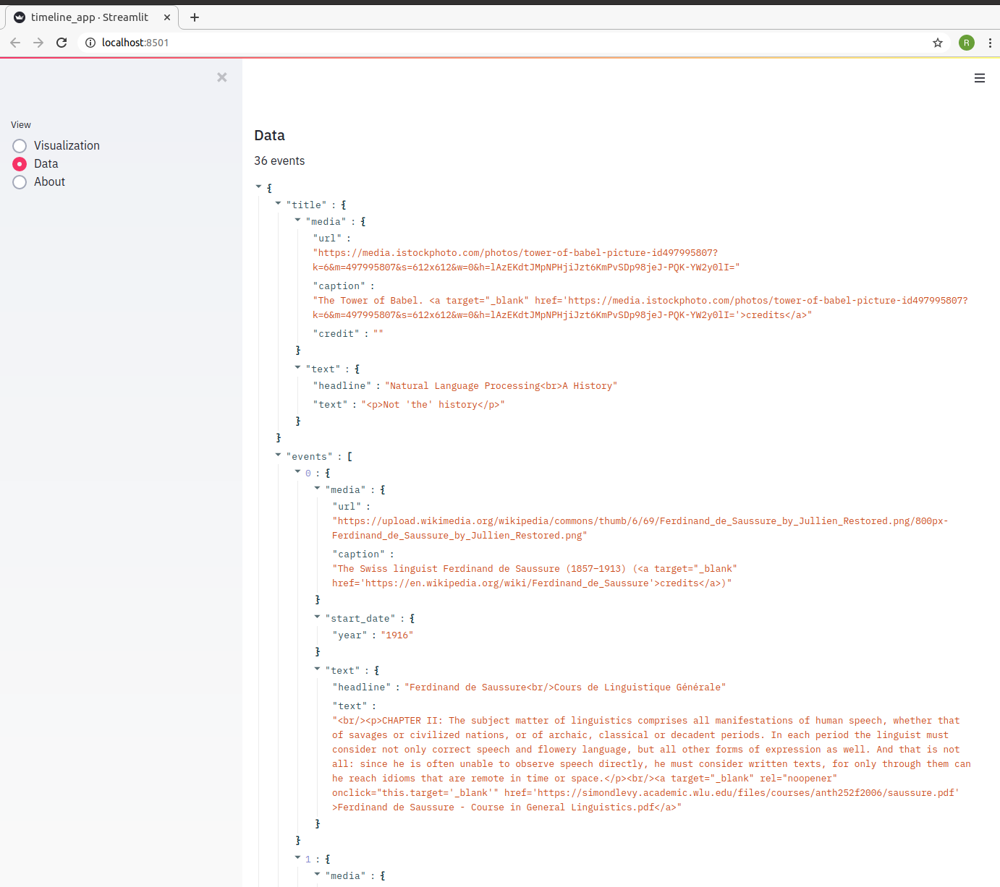

# Natural Language Processing - A Historical Timeline


[](https://www.innerdoc.com/nlp-timeline-demo/) [](https://twitter.com/innerdoc_nlp)


## About
This demo is created to show the integration of [Streamlit](https://streamlit.io) with [TimelineJS](http://timeline.knightlab.com/). It became a demo timeline about the history of Natural Language Processing!

🔥 There is now also a reusable [Streamlit Timeline component](https://github.com/innerdoc/streamlit-timeline)!


## The result
[Open the demo app!](https://www.innerdoc.com/nlp-timeline-demo/)

Below an example of the demo. In this case: a History for Natural Language Processing!


You can also view the json-data.




## Install and run
```
cd nlp-history-timeline
pip install -r requirements.txt
streamlit run timeline_app.py
```
